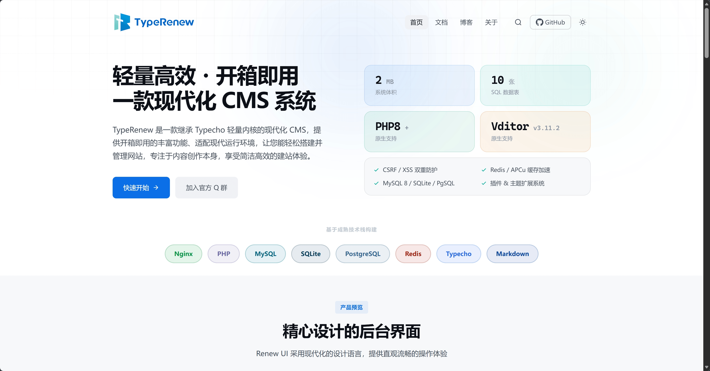

# TypeShow

一款产品展示页模板，轻量高效且预置标准化展示模块，可快速搭建专业产品官网，适配 PHP 8 与 MySQL 8，原生支持 TypeRenew，QQ 交流群：1073739854

## 预览



## 特性

- **原生适配 TypeRenew** - TypeRenew 是基于 Typecho 所开发的现代化 CMS 程序，详见：https://github.com/Yangsh888/TypeRenew
- **产品展示风格** - 简洁专业的产品官网设计
- **深色模式** - 自动跟随系统或手动切换
- **响应式设计** - 完美适配各种屏幕尺寸
- **模块化布局** - Hero 区、截图展示、核心特性、功能亮点、安装指南、更新日志、FAQ 等
- **内置搜索** - 支持文章标题与内容搜索

## 安装

1. 从 Release 中下载压缩包。
2. 进入站点 `/usr/themes/` 目录
3. 将下载的压缩包上传至 `/usr/themes/`目录内，解压文件。
4. 登录后台，进入「控制台 → 外观」，启用主题
5. 进入「外观 → 设置外观」配置主题选项

## 模块配置

| 模块 | 说明 |
|------|------|
| Hero 区 | 主标题、副标题、双按钮、展示截图或统计卡片 |
| 截图展示区 | 最多 5 张截图，第一张自动放大显示 |
| 核心特性区 | Bento Grid 布局，展示性能、安全、部署等特性 |
| 功能亮点区 | 左右交替布局，图文结合展示核心功能 |
| 快速安装区 | 代码块展示安装命令，支持一键复制 |
| 更新日志区 | 版本信息与更新条目展示 |
| 常见问题区 | 可展开/收起的 FAQ 列表 |
| 最新文章区 | 展示最近 3 篇博客文章 |
| 赞助商区块 | 展示合作伙伴 Logo |

## 配置项

### 基础配置

- 站点 Logo（亮色/暗色）
- Favicon 图标
- 站点描述（SEO）
- 导航链接（GitHub、文档、博客）

### Hero 区域

- 主标题（支持换行）
- 副标题
- 主按钮文字与链接
- 次按钮文字与链接
- 展示截图（可选，留空显示统计卡片）
- 统计卡片（4 组数值/单位/说明）

### 截图展示

- 截图图片地址（最多 5 张）
- 截图说明文字

### 功能亮点

- 亮点标题与描述
- 功能截图

### 更新日志

- 当前版本号
- 发布日期
- 完整日志链接
- 日志条目（类型、标题、描述）

### 页脚配置

- 品牌标语
- 友情链接（最多 6 个）
- ICP 备案号
- 社交媒体链接（GitHub、QQ 群、邮箱）
- 自定义 head/footer 代码

## 目录结构

```
typeshow/
├── index.php        # 首页模板
├── post.php         # 文章页
├── page.php         # 独立页
├── archive.php      # 归档页
├── blog.php         # 博客列表页
├── 404.php          # 404 页面
├── header.php       # 头部
├── footer.php       # 底部
├── functions.php    # 主题配置
├── style.css        # 样式表
├── main.js          # 脚本文件
└── screenshot.png   # 主题预览图
```

## 技术栈

- PHP 8.0+
- MySQL 8.0+ / PostgreSQL / SQLite
- 原生 CSS
- 原生 JavaScript

## 页面模板

| 模板文件 | 用途 |
|----------|------|
| `index.php` | 产品展示首页 |
| `blog.php` | 博客列表页（带侧边栏） |
| `post.php` | 文章详情页 |
| `page.php` | 独立页面 |
| `archive.php` | 归档列表页 |
| `404.php` | 404 错误页 |

## 开源许可协议

本项目基于 GNU General Public License 2.0 协议开源。

核心条款：

- 可以自由使用、修改、分发本软件
- 分发时必须保留原始版权声明和许可证
- 修改后的版本必须以相同协议开源
- 不提供任何担保，作者不承担使用本软件产生的任何责任

完整协议文本见 [LICENSE](LICENSE) 文件或访问 [GNU GPL 2.0](https://www.gnu.org/licenses/old-licenses/gpl-2.0.html)。
